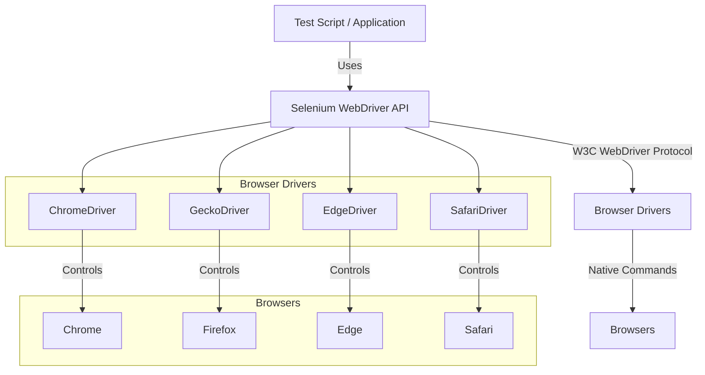

## Selenium WebDriver API

The Selenium WebDriver API is the core component of the Selenium architecture. The API converts test script calls into W3C WebDriver protocol commands, which are then sent to the appropriate browser driver.

## Browser Drivers

Browser drivers are specific to each browser and are responsible for translating the W3C WebDriver protocol commands into browser-specific commands. Examples of browser drivers include:

- ChromeDriver (for Google Chrome)
- GeckoDriver (for Mozilla Firefox)
- EdgeDriver (for Microsoft Edge)
- SafariDriver (for Apple Safari)

## Browsers

The browsers receive and process commands from their respective drivers. They execute the commands and return results to the Selenium WebDriver API. The browsers are the actual web browsers that execute the automated actions.

## Communication Flow

The communication flow between the test script, Selenium WebDriver API, browser driver, and browser is as follows:

1. The test script calls the Selenium WebDriver API methods.
2. The Selenium WebDriver API converts the test script calls into W3C WebDriver protocol commands.
3. The W3C WebDriver protocol commands are sent to the appropriate browser driver.
4. The browser driver translates the W3C WebDriver protocol commands into browser-specific commands.
5. The browser executes the browser-specific commands and returns results to the browser driver.
6. The browser driver returns the results to the Selenium WebDriver API.
7. The Selenium WebDriver API returns the results to the test script.

The below diagram illustrates the communication flow between the test script, Selenium WebDriver API, browser driver, and browser:

