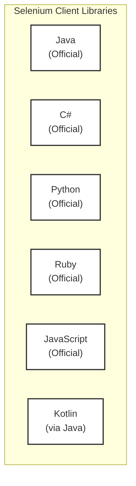

Selenium WebDriver supports multiple programming languages, allowing you to write tests in the language of your choice. Below are the officially supported language bindings for Selenium WebDriver.

---

- **Java**: One of the most popular languages for Selenium WebDriver. It offers robust support and extensive libraries.
- **C#**: Commonly used with .NET applications, providing strong integration with Visual Studio.
- **Python**: Known for its simplicity and readability, making it a great choice for beginners.
- **Ruby**: Offers concise and readable syntax, suitable for quick test script development.
- **JavaScript**: Used with Node.js, allowing for asynchronous testing and integration with modern web development tools.
- **Kotlin**: A modern language that runs on the JVM, offering a more concise syntax compared to Java.
