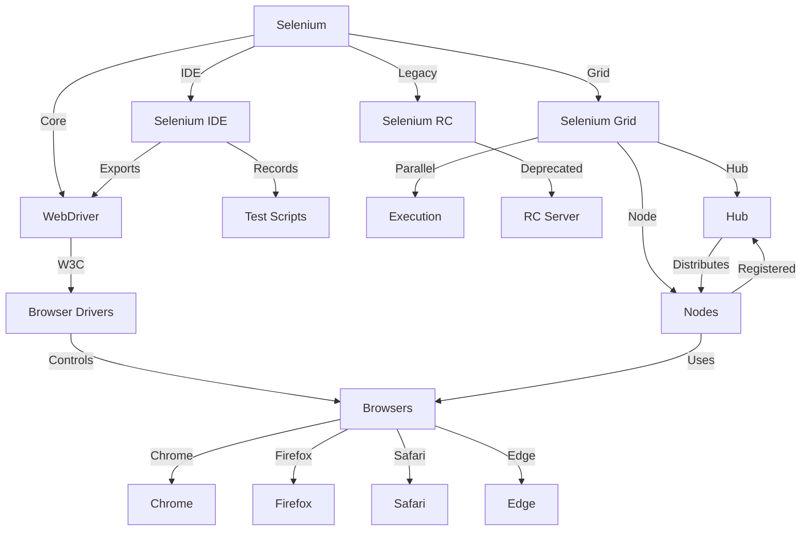

Selenium is a comprehensive suite of tools for automating web browsers. It includes multiple components, each designed for a specific role in the automation process.

---

---

### Selenium WebDriver

Selenium WebDriver is the core component that enables interaction with web browsers. It provides a programming interface to control browsers like Chrome, Firefox, Safari, and Edge. WebDriver allows you to simulate real user actions, such as clicking buttons, entering text, navigating pages, and retrieving information from web pages.

---

### Selenium IDE

Selenium IDE (Integrated Development Environment) is a browser extension (available for Firefox and Chrome) that provides a user-friendly interface for creating automation scripts. It records your actions in the browser and converts them into a script in various programming languages like Java, Python, JavaScript, etc. Selenium IDE is useful for beginners or for quickly creating automation scripts without extensive coding knowledge.

---

### Selenium Grid

Selenium Grid is a tool for running tests in parallel on multiple machines and browsers simultaneously. It is useful for scaling automation tests to multiple browsers and operating systems, improving test execution efficiency. Selenium Grid has a hub-and-node architecture where the hub controls test execution, and nodes run tests on different machines.

---

### Selenium RC (Deprecated)

Selenium RC (Remote Control) was an older component used for controlling web browsers remotely through a server. However, it has been deprecated in favor of Selenium WebDriver, which provides a more direct and efficient approach to browser automation.
