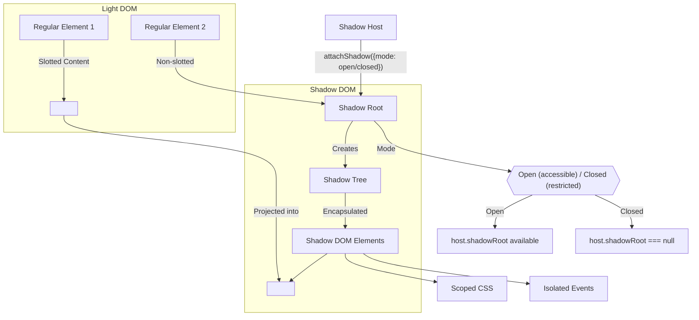

# WebElements

In Selenium WebDriver, WebElement is an interface that represents an HTML element on a web page. It provides various methods to interact with elements, such as clicking, sending text input, retrieving attributes, and more.

## Example Usage

```java
WebElement element = driver.findElement(By.id("username"));
element.sendKeys("testuser");
```

:::info
Here, `element` represents the input field with `id="username"`, and `sendKeys()` is used to enter text into it.
:::

## Common WebElement Methods

Below are some common WebElement methods used in Selenium WebDriver:

### Interaction Methods

| Method           | Description                  | Usage                             |
| ---------------- | ---------------------------- | --------------------------------- |
| `click()`        | Clicks the element           | `element.click()`                 |
| `sendKeys(text)` | Types text into the element  | `element.sendKeys("Hello World")` |
| `clear()`        | Clears text from the element | `element.clear()`                 |
| `submit()`       | Submits a form               | `element.submit()`                |

---

### State Check Methods

| Method          | Description                                                                      | Usage                        |
| --------------- | -------------------------------------------------------------------------------- | ---------------------------- |
| `isDisplayed()` | Returns true if the element is visible                                           | `if (element.isDisplayed())` |
| `isEnabled()`   | Returns true if the element is enabled                                           | `if (element.isEnabled())`   |
| `isSelected()`  | Returns true if the element is selected (for checkboxes, radio buttons, options) | `if (element.isSelected())`  |

---

### Property Methods

| Method                  | Description                            | Usage                                              |
| ----------------------- | -------------------------------------- | -------------------------------------------------- |
| `getText()`             | Gets visible text of the element       | `String text = element.getText()`                  |
| `getAttribute(name)`    | Gets attribute value                   | `String val = element.getAttribute("class")`       |
| `getDomAttribute(name)` | Gets DOM attribute as it is in the DOM | `String val = element.getDomAttribute("class")`    |
| `getDomProperty(name)`  | Gets DOM property                      | `String val = element.getDomProperty("innerText")` |
| `getCssValue(property)` | Gets value of specified CSS property   | `String color = element.getCssValue("color")`      |
| `getTagName()`          | Gets tag name of the element           | `String tag = element.getTagName()`                |
| `getSize()`             | Gets dimension of the element          | `Dimension size = element.getSize()`               |
| `getLocation()`         | Gets location of the element           | `Point location = element.getLocation()`           |
| `getRect()`             | Gets size and location as a rectangle  | `Rectangle rect = element.getRect()`               |

---

### Other Methods

| Method                | Description                                                              | Usage                                            |
| --------------------- | ------------------------------------------------------------------------ | ------------------------------------------------ |
| `getAccessibleName()` | Gets accessible name of the element (mostly used in accessibility tests) | `String name = element.getAccessibleName()`      |
| `getAriaRole()`       | Gets ARIA role of the element (mostly used in accessibility tests)       | `String role = element.getAriaRole()`            |
| `getShadowRoot()`     | Gets access to shadow DOM                                                | `SearchContext shadow = element.getShadowRoot()` |

:::info
The `getShadowRoot()` method is used to access the `Shadow DOM` of an element. It returns a `SearchContext` object, which can be used to interact with the shadow DOM elements.

Read below section for more details.
:::

---

To gain a clearer understanding of the `getShadowRoot()` method, we need to explore the concepts of **Shadow DOM**.

### Shadow DOM Overview

**Shadow DOM** is a web standard that enables encapsulation of styles and behavior within a component, preventing unintended interference from the surrounding document.

It consists of several key components:

| Component            | Description                                                                                                         |
| -------------------- | ------------------------------------------------------------------------------------------------------------------- |
| `Shadow Host`        | The regular DOM element that contains the shadow DOM.                                                               |
| `Shadow Root`        | The entry point of the shadow tree, created using `attachShadow()` on the shadow host.                              |
| `Shadow Tree`        | The internal structure of elements inside the shadow root, which remains isolated from the main document.           |
| `Encapsulation`      | Elements inside the shadow tree do not inherit styles from the global document unless explicitly designed to do so. |
| `Mode (Open/Closed)` | The shadow root can be open (accessible via JavaScript) or closed (restricted access).                              |

---


